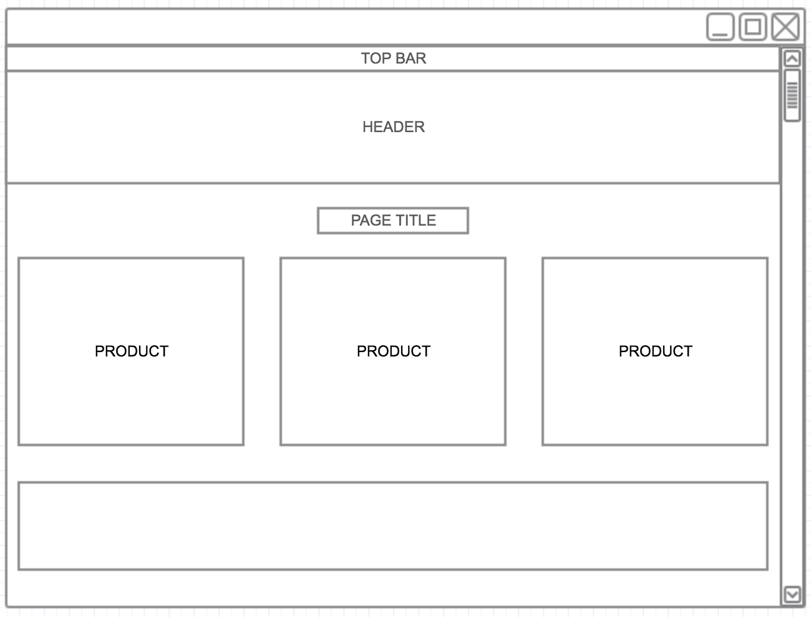
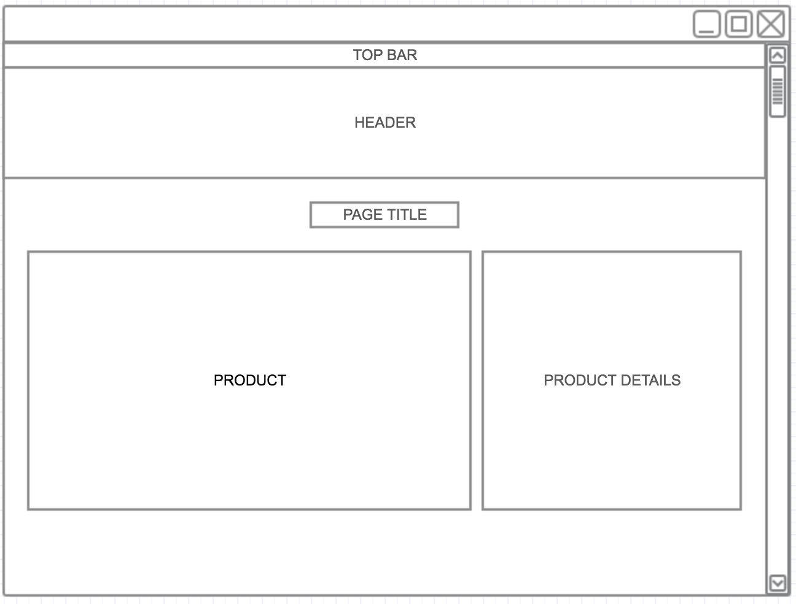
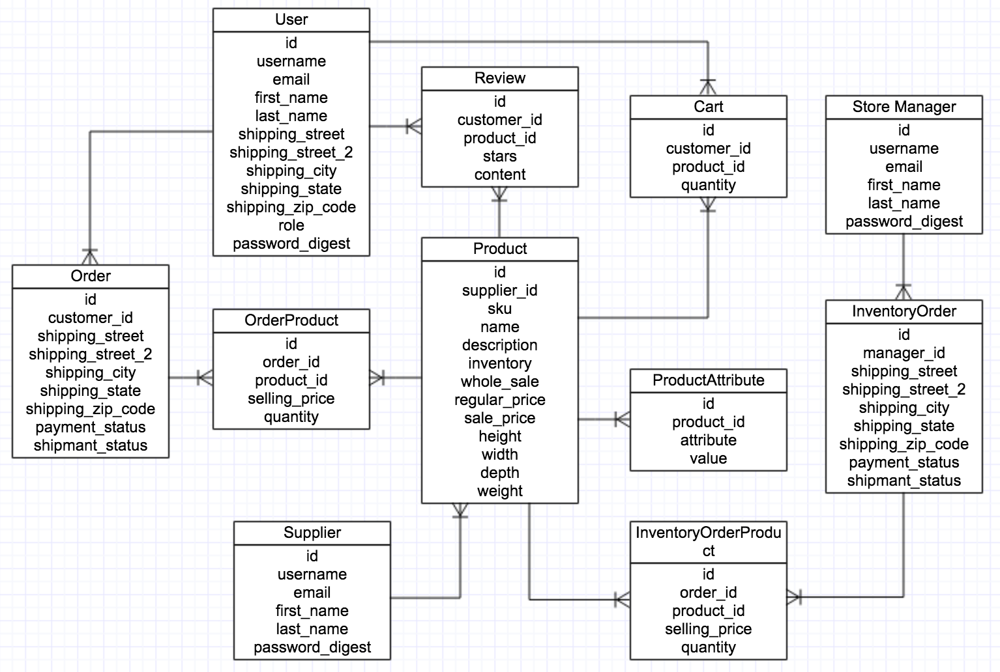

# Truly LA

Truly LA is an e-commerce website that features locally made products by small independent makers within the county of Los Angeles. The mission is to bring healthy and fresh products to your doorstep.

This online store provides an avenue to promote/support local products and a platform for independent makers to widen their reach with little to no cost.

### Author

* Kevin Pagtakhan

## Development

### Wireframe
Home page

Product page

### Entity Relationship Diagram

### Technology Used
Ruby on Rails, HTML, CSS, Bootstrap, Postgresql

### User Stories

#### As an admin:

* I can login/logout.
* I can view the list of all users, all admins, all suppliers, and all customers.
* I create new accounts for supplier and admins
* I can view/edit users
* I can view the list of all orders, all completed ord ers, all pending orders.
* I can create new products
* I can edit existing products
* I can view store inventory
* I can view all orders
* I can add products to my cart
* I can view my cart
* I can checkout my cart
* I can place an order to site suppliers
* I can mark customer orders as shipped
* I can mark supplier shipment as received

#### As a supplier:

* I can login/logout
* I can view/edit my user account details
* I can view the list of products
* I can add products to the cart
* I can simulate order checkout
* I can view my order details
* I can view admin's order to my products
* I can mark admin's orders as shipped

#### As a customer:

* I can login/logout
* I can sign up for a customer account
* I can view/edit my account 
* I can view the list of products
* I can add products to my cart
* I can simulate order checkout
* I can view my order details
* I can leave product reviews

## Future Work

#### As an admin:

* I can replenish my inventory by marking an order as received
* I can process return requests
* I can process refund requests
* I can ad custom product attributes
* I can auto generate email notifications order updates
* I can send site wide notifications to all users
* I can send messages with other users
* I can receive supplier/custom payments

#### As a supplier:

* I can send messages with other admins
* I can send new product requests

#### As a customer:

* I can send return requests
* I can send refund requests
* I can send messages with admins
* I can send payments
* I can view site wide notifications

### How to run locally

1. Clone the repo.
2. Install ruby.
2. Install rails:

        $ gem rails

3. Change your directory to trulyla: 

        $ cd trulyla

4. Install gem files:

        $ bundle install
        
5. Start your server:

        $ rails server
        
6. Open your browser and go to `http://localhost:3000`.

### Contributing
1. Fork it
2. Create your feature branch: git checkout -b new-feature
3. Commit your changes: git commit -m 'Some feature'
4. Push to your feature branch: git push origin new-feature
5. Submit a pull request

## Acknowledgements
Credits to the following:

* JL Hernandez, founder of Craft and Main, for project idea
* Owners of other images used